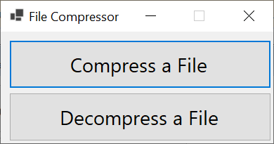
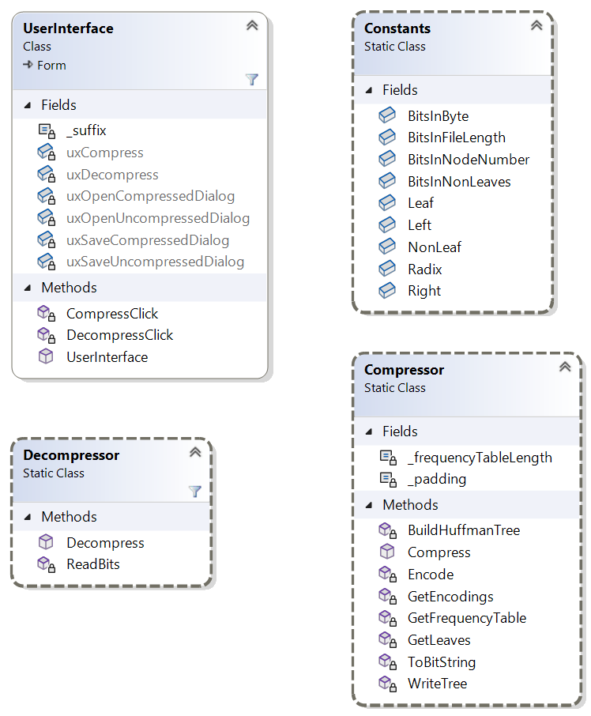

# Homework Assignment 5: File Compression/Decompression

For this assignment, you will write a file compressor/decompressor using code from Lab Assignment 26. 

## 0. Contents

[TOC]

## 1. User Requirements

The user needs a code base for experimenting with new file compression techniques. This code base needs to be a fully-functioning program that compresses and decompresses files. However, it needs to implement only the most basic compression involving the use of a variable-width encoding, computed by using a Huffman tree as built in Lab Assignment 26. The company will then build on this code base by trying additional techniques. The compression should be *lossless*; i.e., decompressing a compressed file should produce an exact copy of the original file. The program only needs to compress single files.

## 2. Format of Compressed Files

If the file to be compressed is nonempty, the compressed file produced by this program should have the following format:

- The first 63 bits should give the length (in bytes) of the original file. 

- The next 8 bits should be the number of non-leaf nodes in the Huffman tree. In what follows, we will refer to this value as *n*. In any binary tree, the number of leaves is one more than the number of non-leaves. Any nonempty Huffman tree has from 1 to 256 leaves; hence, *n* will range from 0 to 255, which is exactly the range that can be stored in 8 bits.

- The next 19*n* + 9 bits should contain a description of the Huffman tree. This description consists of a description of each node in the tree, in an order such that each non-leaf occurs somewhere after its left child and immediately following its right child. We will associate with each node a *node number*, which is the number of nodes written prior to this node. Thus, the first node written has a node number of 0, the second has a node number of 1, etc. Because the Huffman tree can contain at most 255 + 256 = 511 nodes, all node numbers will be less than 511; hence, a node number can be stored in 9 bits. A node should be written as follows:

  - If the node is a leaf, its first bit should be 0, and its next 8 bits should be the byte stored in the node (9 bits total).
  - Otherwise, its first bit should be a 1, and its next 9 bits should be the node number of its left child (10 bits total).

  Because a Huffman tree with *n* non-leaves always has exactly *n* + 1 leaves, the total number of bits in its description is 10*n* + 9(*n* + 1) = 19*n* + 9.

- What follows is the encoding of the original file using the variable-width encoding scheme given by the Huffman tree. The length of this encoding depends on the contents of the original file.

- If the end of the above encoding is not at a byte boundary, up to 7 bits of zeros are added to bring it to a byte boundary (this will be done automatically for you when the stream is closed).

If the original file is empty, the compressed file should be 8 bytes of 0s. These 8 bytes represent the first 63 bits above, which encode a file length of 0, followed by one 0 bit to bring the total to a byte boundary. 

Note that the reason we need to encode the length of the original file is due to the possible presence of the extra bits needed to reach a byte boundary. Because these bits may be present, we need to know when to stop reading the encoding when decompressing the file.

Note that because of the need to write the file length and the Huffman tree, the compressed file can in some cases be longer than the original file (for example, when the original file is empty). This is not surprising - in fact, it is possible to show that any lossless compression scheme that reduces the length of some files must also increase the length of some files. In the worst case, this scheme can increase the length by as much as 616 bytes.

## 3. Starting the Assignment

 Create a GitHub repository using the URL provided in Canvas. This repository contains the model solution to Lab Assignment 26 with the following files added:

- **Ksu.Cis300.BitIO.dll**, which provides the namespace **Ksu.Cis300.BitIO** for reading and writing files a bit at a time (see [Section 6. Provided Data Types](#6. Provided Data Types)).
- **BinaryFileViewer.exe**, an executable that allows you to examine the contents of a file at the bit level (see [Section 8. Testing and Debugging](#8. Testing and Debugging)).
- **FileCompare.exe**, an executable that allows you to compare two files (see [Section 8. Testing and Debugging](#8. Testing and Debugging)).
- **Ksu.Cis300.FileCompare.\***, three files that need to be in the same folder as **FileCompare.exe** in order for that program to run.

In addition, several new files were added to **Data.zip**. Finally, a unit test project, **Ksu.Cis300.HuffmanTrees.Tests**, has been added.

## 4. User Interface

In this section, we will describe the look and behavior of the GUI that you are to design. We will first outline what you will need to build using the Design window. Then we will describe the required behavior of the GUI. You will need to provide code to implement this behavior (see [Section 7. Coding Requirements](#7. Coding Requirements)). The [demo video](https://youtu.be/CCfqO8mwC3M) also illustrates the expected look and behavior.

### 4.1. Manual User Interface Design

The main GUI should be modified to resemble the following:

The GUI will also have two **OpenFileDialog**s (one for opening uncompressed files and one for opening compressed files) and two **SaveFileDialog**s (one for saving compressed files and one for saving uncompressed files) associated with it. The **FileName** properties for these dialogs should all be empty. The **Filter** property for each of the dialogs for uncompressed files should be set to `All files (*.*)|*.*` to allow display of all file types. For each of the dialogs for compressed files, the **Filter** property should be set to `Compressed files (*.cmp)|*.cmp|All files (*.*)|*.*` to cause files with a suffix of ".cmp" to be shown by default. For these latter two dialogs, the **SupportMultiDotted** property needs to be set to **True** to allow the handling of file names like `file.txt.cmp`. The **Title** property for the **OpenFileDialog** for uncompressed files should be set to `Compress File`. The **Title** property for the other **OpenFileDialog** should be set to `Decompress File`.

### 4.2. Behavior of the GUI

The functionality of the two buttons is described in what follows. After that, the exception handling you will need to include is described.

#### 4.2.1. Compress a File

Clicking this button should open the **OpenFileDialog** for uncompressed files. Its title should be, "Compress File". Furthermore, there should be no file name displayed when this dialog is first opened (when it is opened again, it can have the name of the last file selected for compression). Finally, the filter dropdown should contain a single entry, "All files (\*.\*)", which should allow all files to be shown. 

If the user selects a file from the above dialog, the **SaveFileDialog** for compressed files should be displayed. The title of this dialog should be "Save As", and the file name shown should be the file selected in the above dialog, with ".cmp" appended.

**Note:** In order to get the file name to be set properly when saving either a compressed or decompressed file, you will need to configure your system to display file name extensions. Instructions for doing this can be found [here](https://www.howtogeek.com/205086/beginner-how-to-make-windows-show-file-extensions/).

The filter dropdown should contain two entries:

- "Compressed files (\*.cmp)", which should show all file names ending in ".cmp". This should be the default.
- "All files (\*.\*)", which should show all files.

If the user selects a file from the second dialog, the program should compress the contents of the first file selected and place the result in the second file selected. After the compressed file is successfully written, a **MessageBox** displaying the message, "Compressed file written.", should be shown. If any exception is thrown, it should be displayed in a **MessageBox**. Exceptions due to programmer error should not be thrown.

If the user cancels either dialog without selecting a file, nothing more should be done.

#### 4.2.2. Decompress a File

Clicking this button should display the **OpenFileDialog** for compressed files. Its title should be, "Decompress File", and its filter dropdown should be like the one for the **SaveFileDialog** described above. If the user selects a file from this dialog, the **SaveFileDialog** for uncompressed files should be displayed. It should be similar to the **SaveFileDialog** described above, except that the filter dropdown should be like the one for the **OpenFileDialog** for uncompressed files. Furthermore, if the file name that was chosen in the **OpenFileDialog** ends in ".cmp", the file name shown in the **SaveFileDialog** should be the same name, but with the ".cmp" removed. Otherwise, the file name should be empty.

If the user selects a file from the second dialog, the program should decompress the contents of the first file selected and place the result in the second file selected. After the compressed file is successfully written, a **MessageBox** displaying the message, "Decompressed file written.", should be shown. The decompressed file should be identical to the original uncompressed file. If any exception is thrown, it should be displayed in a **MessageBox**. Exceptions due to programmer error should not be thrown.

If the user cancels either dialog without selecting a file, nothing more should be done.

### 4.3. Exception Handling

You do not need to check explicitly for any errors during file compression. During file decompression, however, you need to check explicitly for the following errors in the input file:

- If an internal Huffman tree node (i.e., a non-leaf) has a node number *n* and the node number given for its left child is *n* or larger, throw an **IOException** containing the message "The Huffman tree is improperly formed."
- If the end of the input is reached at any time before the decompression is finished, throw an **IOException** containing the message, "Unexpected end of compressed data."

## 5. Software Architecture

The following class diagram shows the classes to be included in the project, **Ksu.Cis300.HuffmanTrees**.

The **static** class **Constants** will contain definitions of constants that will be used by the other classes in this project. The **static** classes **Compressor** and **Decompressor** will contain **static** methods for compressing and decompressing, respectively, a [**Stream**](https://learn.microsoft.com/en-us/dotnet/api/system.io.stream?view=net-6.0). Note that several of the methods, perhaps with modifications (see [Section 7. Coding Requirements](#7. Coding Requirements)), of the **Compressor** class are already in the **UserInterface** class. They will need to be moved to the **Compressor** class.

In order for the unit tests to compile, the names of all **public** members must match the names in the above class diagram.

## 6. Provided Data Types

Several other types are provided - these are not shown in the class diagram above. The **BinaryTreeNode\<T\>** class (in the **Ksu.Cis300.ImmutableBinaryTrees** namespace) has been provided in **Ksu.Cis300.ImmutableBinaryTrees.dll**, and the class library project containing **MinPriorityQueue<TPriority, TValue>** (in the **Ksu.Cis300.PriorityQueueLibrary** namespace) has been included. In addition, the DLL **Ksu.Cis300.BitIO.dll** provides the namespace **Ksu.Cis300.BitIO**, which contains two classes for reading and writing a bit at a time. These two classes are described in what follows.

### 6.1. BitInputStream

This class supports reading individual bits. It contains two constructors, but the only one you will need takes as its only parameter a **string** giving the path name of the file to be read. The only method you will need is the **ReadBits** method, which takes as its only parameter an **int** giving the number of bits to read. It returns a **string** of `1`s and `0`s giving the bits read from the stream. The length of the string returned will be the value passed as the parameter if the stream contains at least this many bits. If the stream contains fewer bits, the string will contain all of the remaining bits from the stream. Note that this means that the empty string is returned if no bits remain.

Instances of this class may be defined within **using** statements.

### 6.2. BitOutputStream

This class supports writing individual bits. It contains two constructors, but the only one you will need takes as its only parameter a **string** giving the path name of the file to be written. The only method you will need is the **WriteBits** method, which takes as its only parameter a **string** containing the bits to be written. If this string is **null**, empty, or contains any characters other than '0' or '1', an **ArgumentException** will be thrown. It returns nothing. 

Instances may be defined within **using** statements.

## 7. Coding Requirements

The coding requirements for the **Compressor**, **Decompressor**, and **UserInterface** classes are described in what follows.

### 7.1. The Constants Class

This **static** class needs the following **public static readonly** fields:

- **BitsInFileLength**: an **int** giving the number of bits in the file length field (63).
- **BitsInNonLeaves**: an **int** giving the number of bits in the field giving the number of non-leaves (8).
- **Leaf**: a **string** giving the bit used to indicate that a Huffman tree node in a compressed file is a leaf ("0").
- **NonLeaf**: a **string** giving the bit used to indicate that a Huffman tree node in a compressed file is a non-leaf ("1").
- **BitsInByte**: an **int** giving the number of bits in a byte (8).
- **BitsInNodeNumber**: an **int** giving the number of bits in a node number (9).
- **Radix**: an **int** giving the radix for a bit string (2; i.e., a bit string encodes a value in base 2).
- **Left**: a **string** giving the bit string to use to indicate a left child ("0").
- **Right**: a **string** giving the character to use to indicate a right child ("1").

### 7.2. The Compressor Class

You will need two **private** fields, one **public** method, and at least six **private** methods for this class. Feel free to break the code into additional **private** methods. Because the class is to be **static**, all of these methods must also be **static**. The field and the **private** methods **GetFrequencyTable**, **GetLeaves**, and **BuildHuffmanTree** provided in the **UserInterface** class should be moved to this class. One of these methods will need to be modified - this change and the four new methods are described in what follows. No exception handling (i.e., **try-catch**) should be done within this class - it should be left to the **UserInterface** class instead.

As numeric values are converted to bit strings, it may be necessary to pad the bit string on the left with `0`s to get the proper length. To facilitate this padding, define a **private static readonly char** field to store this padding character ('0').

#### 7.2.1. The **GetFrequencyTable** method

The parameter to this method should be changed to **Stream** so that it can be used with various kinds of input streams. **Stream** is a super-type of **FileStream**; hence, you can use this parameter in place of the **FileStream** variable. Because this stream will be opened and closed in the **UserInterface** class, you will not need the **using** statement. Otherwise, the method should remain the same.

#### 7.2.2. A **private** method to convert a value to a bit string

This method should take as its parameters a **long** giving the value to convert, and an **int** giving the minimum length of the bit string to be produced. It should return a **string** giving this bit string. The [**Convert.ToString**](https://learn.microsoft.com/en-us/dotnet/api/system.convert.tostring?view=net-6.0#system-convert-tostring(system-int64-system-int32)) method has an overload that takes a **long** to convert and an **int** (which must be either 2, 8, 10, or 16) giving the radix to use for conversion. Thus, the given long can be converted to a bit string by using the appropriate constant from the **Constants** class as the second parameter to **Convert.ToString**. However, this string might be shorter than the given minimum length. You can use the **string**'s [**PadLeft**](https://learn.microsoft.com/en-us/dotnet/api/system.string.padleft?view=net-6.0#system-string-padleft(system-int32-system-char)) method to pad the string to given minimum length using the appropriate character constant above. 

Note that as long as the calling code provides a value that will fit in a bit string of the given minimum length, the string returned will have exactly this length. Note also that this method can be passed either an **int** or a **byte** as the first parameter without doing any explicit type conversions.

#### 7.2.3. A **private** method to write the Huffman tree

This method should take the following parameters:

- a **BinaryTreeNode\<byte\>** giving a Huffman tree, which you may assume to be non-**null**;
- a **BitOutputStream** giving the the stream to which to write the tree; and
- an **int** giving the number of nodes written so far.

It should return an **int** giving the node number of the root of the the given tree. This method should write all the nodes, as described in [Section 2. Format of Compressed Files](#2. Format of Compressed Files), using a postorder traversal.

If the given tree is a leaf (in a Huffman tree, if either child is empty, they both are, so you only need to check one), first write a bit to indicate that it is a leaf (use the appropriate constant). Then write the byte value stored in the node (use the above method with the appropriate constant to get the bit string to write). Return this leaf's node number, which is the number of nodes that were written before it was written. (**Note:** You should only use the **BitOutputStream**'s **WriteBits** method for writing output. Don't use other **BitOutputStream** methods such as **WriteByte**, as these methods will throw exceptions if the stream is not at a byte boundary.)

If the given tree is not a leaf, first recursively write each of the children, left child first, and save the values returned by these calls. For the third parameter of the recursive calls, you will need to determine how many nodes have been written up to this point (it will either be the given number of nodes written or one more than the node number of the root of the tree that was just written). After the children have been written, write a bit to indicate that the node you are now writing is a non-leaf. Then write the node number of the root of the left child. Return the node number of the root.

#### 7.2.4. A private method to get the variable-width encodings

This method should take the following parameters:

- a **BinaryTreeNode\<byte\>** giving a non-**null** Huffman tree (which may be a sub-tree of the entire Huffman tree);
- a **StringBuilder** describing the path in the entire Huffman tree to the given sub-tree (a '0' indicates the left child, and a '1' indicates the right child); and
- a **string[ ]** in which the encodings will be stored (you may assume it has 256 locations).

It should not return anything. This method will need to traverse the given tree, and at each leaf, place the description of the path to that leaf (as a **string**) in the given **string[ ]** at the index indicated by the **byte** stored in the leaf. Because only leaves will be processed, it doesn't make sense to call this an inorder, preorder, or postorder traversal (it could actually be any of the three). There are only two cases. If the tree is a leaf, store the given path in the array element indexed by the **byte** stored in the node. Otherwise, recursively get the encodings for the two children. Prior to making each recursive call, append the appropriate constant to the **StringBuilder**, and remove this value after the recursive call.

#### 7.2.5. A **public Compress** method

This method should take as its parameters a **Stream** giving the data to be compressed and a **BitOutputStream** to which the compressed data will be written. It should return nothing. It is responsible for compressing the given input file to the given output file in the format described under "Compressed File Format" above. You don't need any **using** statements because the streams will be opened and closed in the **UserInterface** class. 

First, make sure both parameters are non-**null** - if either is **null** throw an **ArgumentNullException**. Then get the length of the stream using its [**Length**](https://learn.microsoft.com/en-us/dotnet/api/system.io.stream.length?view=net-6.0) property, which gets a **long**, and write it to the output stream using the proper number of bits. If the length of the input stream is nonzero:

1. Build the frequency table.
2. Build a **MinPriorityQueue** containing the leaves of the Huffman tree.
3. Write the number of non-leaves in the tree (you can compute this from the number of leaves in the **MinPriorityQueue**).
4. Build the Huffman tree.
5. Write the Huffman tree.
6. Get the variable-width encodings. The array passed to the method that does this should have the same length as the frequency table.
7. Return the input stream to its beginning by using its [**Seek**](https://learn.microsoft.com/en-us/dotnet/api/system.io.stream.seek?view=net-6.0) method, using 0 as its first parameter and **SeekOrigin.Begin** as its second parameter.
8. Write each byte from the input, using its variable-width encoding. It's possible that the length of the encoding is 0 (meaning all the bytes in the input file are the same) - if so, don't try to write anything, as the **BitOutputStream**'s **WriteBits** method requires a length of at least 1.

### 7.3. The Decompressor Class

You will need one **public** method and at least three **private** methods for this class. Because the class is to be **static**, all of these methods must also be **static**. No exception handling (i.e., **try-catch**) should be done within this class - it should be left to the **UserInterface** class instead. In what follows, we describe one of the **private** methods and the **public** method. You must break the code into at least two more **private** methods.

#### 7.3.1. A **private** method to read a given number of bits

This method should take an **int** giving the number of bits to read and a **BitInputStream** from which to read the bits. It should return a **string** containing the bits read. Its main purpose is to read the given number of bits using the **BitInputStream**'s **ReadBits** method, and to return what that method returns. In addition, it needs to do a little error checking. The **BitInputStream**'s **ReadBits** method returns a **string** giving the bits actually read. This returned value is this method's only mechanism for reporting whether it has tried to read past the end of the stream. However, if your program is working correctly and the input is a correctly-formed compressed file, it should never try to read past the end of the stream. Thus, you will need to compare the number of bits actually read with the number of bits you tried to read, and if those values are different, throw an exception as described under "Exception Handling" above.

You should use this method whenever you need to read from a **BitInputStream**.

#### 7.3.2. A **public** Decompress method

This method should take as its parameters a **BitInputStream** containing the compressed data and a **Stream** to which the decompressed data will be written. It should return nothing. It is responsible for decompressing the given input stream to the given output stream, assuming the input stream is in the format described under "Compressed File Format" above. Don't include any **using** statements, as the streams will be opened and closed in the **UserInterface** class. 

First, make sure both parameters are non-**null** - if either is **null** throw an **ArgumentNullException**. Then read the length of the uncompressed stream from the input. The [**Convert.ToInt64**](https://learn.microsoft.com/en-us/dotnet/api/system.convert.toint64?view=net-6.0#system-convert-toint64(system-string-system-int32)) method has an overload that takes the **string** to convert as the first parameter and radix to use for the conversion as the second parameter (the [**Convert.ToInt32**](https://learn.microsoft.com/en-us/dotnet/api/system.convert.toint32?view=net-6.0#system-convert-toint32(system-string-system-int32)) and [**Convert.ToByte**](https://learn.microsoft.com/en-us/dotnet/api/system.convert.tobyte?view=net-6.0#system-convert-tobyte(system-string-system-int32)) methods have similar overloads). If this length is nonzero:

1. Read the number of non-leaves in the Huffman tree, and compute the total number of nodes.
2. Read the Huffman tree into a **BinaryTreeNode\<byte\>[ ]**. Read the data describing each node, build a binary tree node from this data, and store it in the next array location. Each node number can be used as an index into the array. If a node number greater than or equal to the current index is read, throw the appropriate exception as explained under "Exception Handling" above. The last node placed in the array will be the root of the tree.
3. Read the remainder of the input a bit at a time, using the Huffman tree to decode these bits, and write each decoded byte. Set this up as nested loops. The outer loop should iterate once for each byte in the uncompressed stream. The inner loop should start at the root of Huffman tree, and on each iteration, read a bit and use it to determine which child to go to. Stop iterating the inner loop when a leaf is reached, and write the **byte** stored in this leaf.

### 7.4. The UserInterface Class

Within this class, you will need an event handler for each of the buttons. These event handlers are described in what follows. You may include any additional **private** methods that you feel improve the quality of the code. You will also need a **private const string** field to store the suffix to be used for compressed file names (".cmp").

#### 7.4.1. The event handler for the "Compress a File" button

Using the **public** method in the **Compressor** class, you should now be able to implement this event handler so that it behaves as described in [Section 4.2.1. Compress a File](#4.2.1. Compress a File). Use **using** statements to define each of the streams. You can nest these **using** statements. Use [**File.OpenRead**](https://learn.microsoft.com/en-us/dotnet/api/system.io.file.openread?view=net-6.0) to create the input stream, and the **BitOutputStream** constructor described under "**BitOutputStream**" above to construct the output stream.

#### 7.4.2. The event handler for the "Decompress a File" button

Using the above methods, you should now be able to write this event handler so that it behaves as described in [Section 4.2.2. Decompress a File](#4.2.2. Decompress a File). Be careful in setting the default file name in the **SaveFileDialog** - the file name chosen in the **OpenFileDialog** may be shorter than the suffix you are looking for. Use the **File.Create** method to create the output stream.

## 8. Testing and Debugging

Unit tests have been provided to help you to test and debug the functionality of the **Compressor** and **Decompressor** classes. In debugging these tests, be sure to pay attention not only to the feedback provided by the test itself, but also to the comments in the test code. The feedback and comments have been structured to help you to narrow down where the bugs are occurring. For example, some of the tests for compressing a stream check the individual components of the compressed output and display discrepancies in a format that is easier to read than raw data. Specifically, the leaves of the Huffman tree are displayed as strings of the form:

> Leaf 0x*hexValue* '*charValue*'

Where *hexValue* is the value of the byte stored in the leaf displayed in hexadecimal, and *charValue* is this value displayed as a character. The non-leaves are displayed as strings of the form:

> Non-leaf 0x*hexValue* *decimalValue*

Where *hexValue* is the node number of the left child displayed in hexadecimal, and *decimalValue* is this number displayed in decimal.

Group the tests first by class, then by trait, and work through the failed tests alphabetically within this grouping. When debugging tests with multiple failures, focus first on the first failure, as it may affect the remaining failures.

Because the unit tests don't test the **UserInterface** class, you will need to test the full program on some data files. Furthermore, debugging the unit tests might in some cases be easier if you can see the full results of your compression, along with expected results. For these purposes, data files have been provided for you in **Data.zip**. For best results, unzip this archive using the "Extract All" facility built into Windows (i.e., right-click on the file in the Windows File Explorer, and select "Extract-All..."). Other methods of unpacking the archive might result in Unix-style line-end characters being translated to Windows-style - this will cause your compressed files to be different from the expected output files provided (though they should still decompress back to the original file).

This archive contains several uncompressed files, the corresponding compressed files that your program should produce, and several bad compressed files that can be used for testing your program's error checking. Specifically, it contains the following files:

- **badTree1.txt.cmp**: Compressed data in which the Huffman tree is improperly formed (it has a node whose left child is itself). Attempting to decompress this file should result in an error message being displayed, as described under "Exception Handling" above. The contents of this file are used in the unit test **DecompressorTests.TestDecompressBadTree1**.
- **badTree2.txt.cmp**: Compressed data in which the Huffman tree is improperly formed (it has a node whose node number is smaller than the node number of its left child). Attempting to decompress this file should result in an error message being displayed, as described under "Exception Handling" above. The contents of this file are used in the unit test **DecompressorTests.TestDecompressBadTree2**.
- **banana.txt**: A short (7 bytes) plain-text file. The contents this file are encoded in `Utilities.Banana` in the unit test code.
- **banana.txt.cmp**: The expected result of compressing **banana.txt** (19 bytes). The contents of this file are encoded in `Utilities.BananaCompressed` in the unit test code.
- **bonnie.txt**: A slightly longer (115 bytes) plain-text file.  The contents of this file are encoded in `Utilities.Bonnie` in the unit test code.
- **bonnie.txt.cmp**: The expected result of compressing **bonnie.txt** (113 bytes). The contents of this file are encoded in `Utilities.BonnieCompressed` in the unit test code.
- **bonnieTruncatedEncodings.txt.cmp**: Compressed data in which the variable-width encodings end prematurely. Attempting to decompress this file should result in an error message being displayed, as described under "Exception Handling" above. The contents of this file are used in the unit test **DecompressorTests.TestDecompressTruncatedEncodings**.
- **bonnieTruncatedLength.txt.cmp**: Compressed data in which the file length is truncated. Attempting to decompress this file should result in an error message being displayed, as described under "Exception Handling" above. The contents of this file are used in the unit test **DecompressorTests.TestDecompressTruncatedLength**.
- **bonnieTruncatedNodeCount.txt.cmp**: Compressed data in which the number of non-leaves is truncated. Attempting to decompress this file should result in an error message being displayed, as described under "Exception Handling" above. The contents of this file are used in the unit test **DecompressorTests.TestDecompressTruncatedNodeCount**.
- **bonnieTruncatedTree1.txt.cmp**: Compressed data in which the Huffman tree ends prematurely - specifically, between nodes. Attempting to decompress this file should result in an error message being displayed, as described under "Exception Handling" above. The contents of this file are used in the unit test **DecompressorTests.TestDecompressTruncatedTree1**.
- **bonnieTruncatedTree2.txt.cmp**: Compressed data in which the Huffman tree ends prematurely - specifically, in the middle of a leaf node. Attempting to decompress this file should result in an error message being displayed, as described under "Exception Handling" above. The contents of this file are used in the unit test **DecompressorTests.TestDecompressTruncatedTree2**.
- **bonnieTruncatedTree3.txt.cmp**: Compressed data in which the Huffman tree ends prematurely - specifically, in the middle of a non-leaf node. Attempting to decompress this file should result in an error message being displayed, as described under "Exception Handling" above. The contents of this file are used in the unit test **DecompressorTests.TestDecompressTruncatedTree3**.
- **cmp**: This is a copy of **bonnie.txt.cmp**. When decompressing, in the "Decompress File" dialog, you will need to change the filter drop-down to "All files (\*.\*)" in order to see this file. The "Save As" dialog should show an empty file name. It should decompress to the same file as **bonnie.txt**.
- **empty.txt**: An empty file. Its contents are used in the unit tests **CompressorTests.TestCompressEmpty** and **DecompressorTests.TestDecompressTruncatedEmpty**. Attempting to decompress this file should result in an error message being displayed, as described under "Exception Handling" above. 
- **empty.txt.cmp**: The expected result of compressing **empty.txt** (8 bytes). Its contents are used in the unit test **DecompressorTests.TestDecompressToEmpty**.
- **index.md**: A medium-sized (57,182 bytes) plain-text file (the markdown file used to generate the instructions files for Homework 3).
- **index.md.cmp**: The expected result of compressing **index.md** (33,628 bytes).
- **Some Zs.txt**: The same byte value (the character 'Z') repeated 10,000 times. Its contents are used in the unit test **CompressorTests.TestCompressSomeZs**.
- **Some Zs.txt.cmp**: The expected result of compressing **Some Zs.txt** (10 bytes). Its contents are used in the unit test **DecompressorTests.TestDecompressSomeZs**.

You can compare two files using the provided executable, **FileCompare.exe**. This executable must be in the same folder as the three provided files whose names begin with **Ksu.Cis300.FileCompare**. Running this executable will open a window containing a single button. Clicking this button will open two **OpenFileDialog**s in sequence to allow you to choose the two files you wish to compare. The program will then display a **MessageBox** containing one of the following messages:

- "The files are the same."
- "The files have different lengths." (The lengths are compared before the file contents are compared.)
- "The files are different." (This lengths are the same in this case.)
- The message from an exception that was thrown while the files were being read.

The executable **BinaryFileViewer.exe** has been included in your repository to provide further assistance in debugging your program. To view a file with this program, open the file from the program's File menu. For performance reasons, if the file is larger than 4K, it will be truncated (this should be more than enough for debugging this assignment). The file is shown in binary, 64 bits per line. The position of the beginning of any selected text, or of the cursor if there is no text selected, is shown as a byte index followed by a bit index within that byte. If there is text selected, its length is shown; if not, this value is 0. If there is a selection of length no more than 63, its value in both decimal and hex is shown. By holding down the Shift key while moving the text cursor with the arrow keys, you can change the end of the selection. This is useful for finding a specific bit length within the file. Using the arrow keys and the Shift key in this way, you can work your way through the different parts of a compressed file, checking whether they are correct.

You can also use the tree viewer provided in the namespace **KansasStateUniversity.TreeViewer2** to display a binary tree. You can construct a form containing a drawing of a tree `t` with the expression `new TreeForm(t, 100)`. (The second parameter gives a maximum height for the tree.) The resulting **TreeForm** can be displayed using either its **Show** method or its **ShowDialog** method (both methods take an empty parameter list). The **Show** method will display the form as a non-modal dialog - i.e., without blocking program execution; however, if the debugger stops at a subsequent breakpoint, the form won't be visible yet. For this reason, the **ShowDialog** method might be more convenient. This method shows the form as a modal dialog, blocking program execution until the form is closed.

Be sure to test your program on several of the provided data files to make sure the **UserInterface** class works properly. Make sure some exception is shown when trying to decompress a file that doesn't contain compressed data.

In addition, you can download large text files from [Project Gutenberg](http://www.gutenberg.org/). 

## 9. Performance

The posted data files should compress/decompress with no noticeable delay. On my Lenovo laptop, it takes about 2 seconds to compress or decompress [The Complete Works of William Shakespeare](https://www.gutenberg.org/cache/epub/100/pg100.txt) (5,638,549 bytes). If your response times are much different from this, factoring in what you know about your machine's performance, you may have implemented something inefficiently.

## 10. Submitting Your Solution

Be sure to **commit** all your changes, then **push** your commits to your GitHub repository. Make sure the **Ksu.Cis300.HuffmanTrees** folder in your repository contains all six .cs files, as we can only grade what is present in the repository. Then submit the _entire URL_ of the commit that you want graded. 

**Note:** The repositories for the homework assignments for this class are set up to use GitHub's autograding feature to track push times. No actual testing/grading is done, but after each push, the GitHub page for the repository will show a green check mark on the line indicating the latest commit. Clicking that check mark will display a popup indicating that all checks have passed, regardless of whether your program works. You may also get an email indicating that all checks have passed. The only purpose for using the autograding feature in this way is to give us a backup indication of your push times in case you submitted your assignment incorrectly.